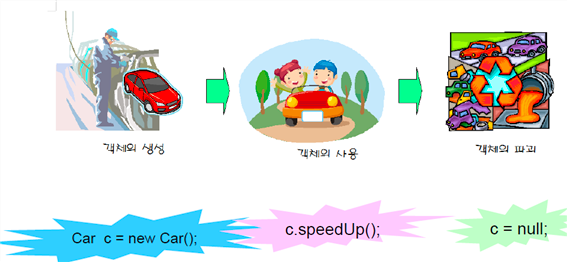

# Object

객체란?
- 물리적으로 존재하건 추상적으로 생각할 수 있는 것 중에서 자신의 속성을 가지고 있으면서 식별 가능한 것
- 물리적으로 존재하는 자동차, 자전거, 책, 사람과 추상적인 학과, 강의, 주문 등이 모두 객체가 될 수 있습니다.

객체의 상호작용
- 현실 세계에서 일어나는 모든 현상은 객체와 객체 간의 상호작용으로 이루어져 있습니다. 
- 객체들은 각각 독립적으로 존재하고, 다른 객체와 서로 상호작용하면서 동작합니다.
- 객체들 사이의 상호작용 수단은 메소드입니다. 이때 객체가 다른 객체의 기능을 이용하는 것이 바로 메소드 호출입니다.

# 핵심 키워드
- 클래스 : 객체를 만들기 위한 설계도입니다.
- 객체 : 클래스로부터 생성되며 'new 클래스()'로 생성합니다.
- new 연산자 : 객체 생성 연산자이며, 생성자를 호출하고 객체 생성 번지를 리턴합니다.
- 클래스 변수 : 클래스로 선언한 변수를 말하며 해당 클래스의 객체 번지가 저장됩니다.
- 인스턴스 : 객체는 클래스의 인스턴스입니다.
- 클래스 멤버 : 클래스에 선언되는 멤버는 필드, 생성자, 메소드가 있습니다.
