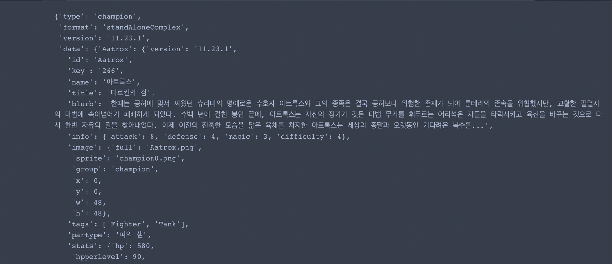
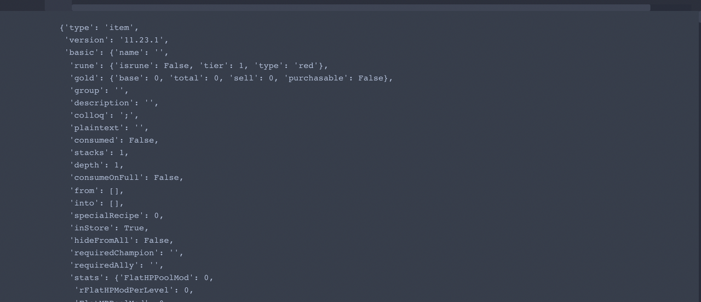

- First Created by KYG. on 2023-01-09

# Python 롤 데이터 구하기

    import pandas as pd
    import requests
    from PIL import Image
    from io import BytesIO

1. 필요한 라이브러리 호출

# requests 라이브러리를 활용하여 챔피언 데이터 가져오기

    champion_json = requests.get('http://ddragon.leagueoflegends.com/cdn/11.23.1/data/ko_KR/champion.json').json()
    champion_json

2. requests 라이브러리를 활용하여 챔피언 데이터 가져오기

# 결과

    
    item_json = requests.get('http://ddragon.leagueoflegends.com/cdn/11.23.1/data/ko_KR/item.json').json()
    item_json

3. 같은 방식으로 아이템 정보 가져오기

# 결과

4. 챔피언 별 이미지 가져오기 및 해당 폴더에 저장하기 champion_json은 1번에서 구한 방식과 동일하다.

# 챔피언 별 이미지 가져오기

    champ_img_url = 'https://ddragon.leagueoflegends.com/cdn/11.23.1/img/champion/'
    for champ_name, detail_data in champion_json['data'].items():
    champ_image_url = f'{champ_img_url}{detail_data["image"]["full"]}'
    champ_image_res = requests.get(champ_image_url)
    image = Image.open(BytesIO(champ_image_res.content))
    image.save(detail_data['key']+'.png')

 