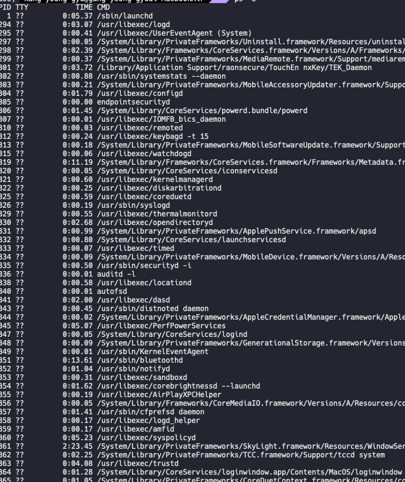

개발자로서 자주 사용하는 PS 명령어에 대해 알아보고자 한다.

ps 명령어란?

- 프로세스의 상태(Process Status : ps)를 확인하는 명령어입니다.

- 명령어 형식은 ps- [옵션]으로 이루어져 있습니다.

ps -a

자주 필요로 하는 프로세스에 대한 정보를 확인

ps -e

현재 수행하고 있는 프로세스에 대한 정보를 확인

ps -f

- 각각의 명령어에 대한 프로세스 ID와 모 프로세스 ID를 포함한 전체 리스틀 표시

ps -i

- 일반적인 로그 리스트를 확인

ps -u

- 사용자 중심 출력

ps -v

- 가상메모리 정보 포함 출력

ps -i

- 터미널 제어 프로세스를 포함하여 출력

ps -ef

- 두가지 옵션을 추가한 것

- e 옵션은 모든 프로세스를 표시

- f 옵션은 프로세스의 정보를 더 많이 보여주도록 하는 옵션입니다.

- 일반적으로 자주 사용하는 옵션이지만 ps -ef만을 사용하면 많은 프로세스가 한번에 표시되기 때문에 grep 명령어로 원하는 키워드를 가려서 사용합니다,