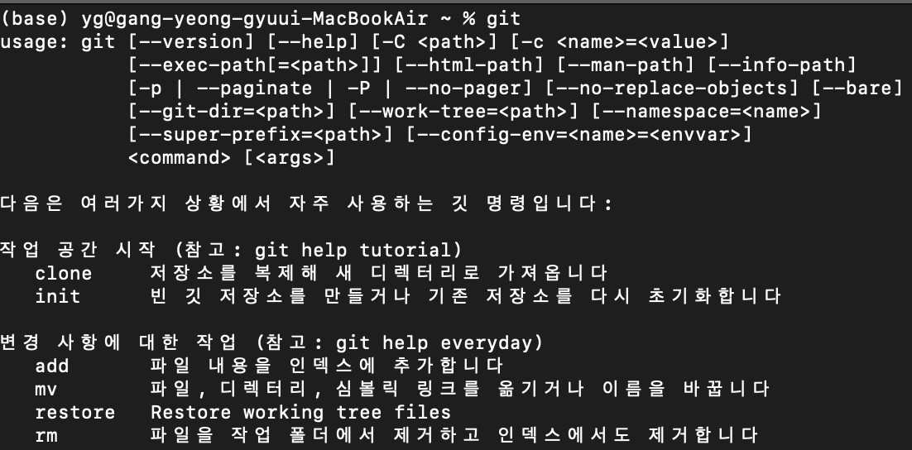
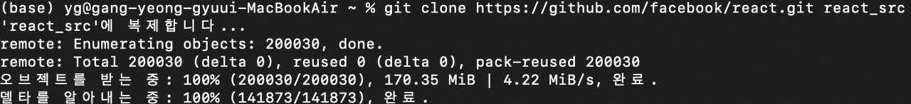
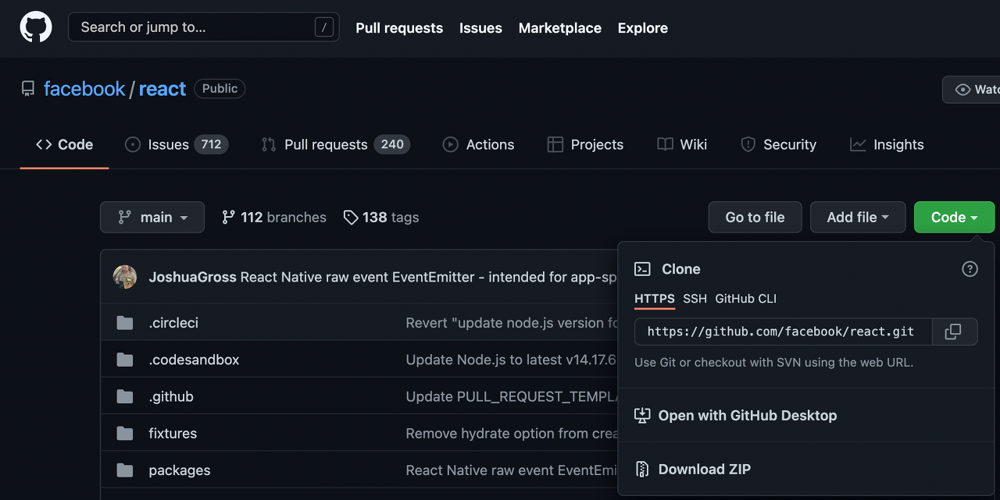
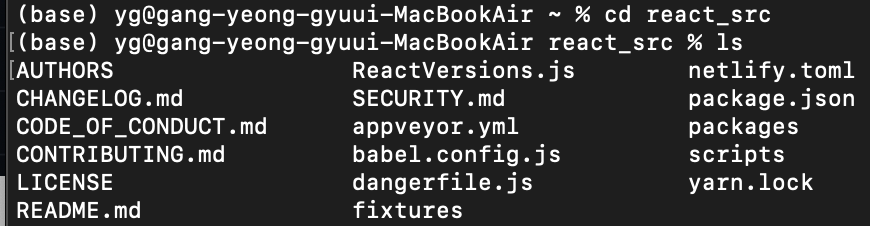

1. 우선 git 명령어를 입력후 git이 설치되어 있는지 확인하자

2. git sudo apt-get install git(우분투 환경)으로 git 설치하기

3. facebook의 오픈소스 react를 받아오기 위해 경로 복사하기

4. 터미널에 git https://github.com/facebook/react.git react_src(해당 오픈소스를 받을 디렉토리 설정)

5. 다운로드 완료

6. 4번에서 설정한 react_src로 이동하기

7.  ls로 목록 확인하기

8. 끝

