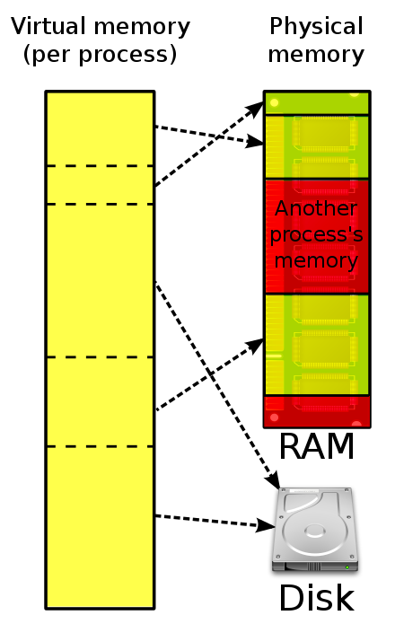

# 가상 메모리
- 메인 메모리는 실제 메모리 또는 물리적 주소이다.
- 가상 메모리는 메모리를 관리하는 또 다른 형태로, 각 프로그램에 실제 메모리 주소가 아닌 가상 메모리 주소를 주는 방법이다.
- 사용자와 논리적 주소를 물리적으로 분리하여 사용자가 메인 메모리 용량을 초과한 프로세스에 주소를 지정해서 메모리를 제한 없이 사용할 수 있도록 하는 개념

# 가상 메모리 등장 배경
1. 초창기 컴퓨터에서는 사용 가능한 RAM의 용량이, 가장 큰 실행 애플리케이션의 주소 공간보다 커야 했음. 그렇지 않을 경우 "메모리 부족" 오류에 의해 해당 애플리케이션을 실행할 수 없었음.
이후 컴퓨터에서는 프로그래머가 애플리케이션의 일부분만 기억장치에 올려 실행하도록 지정할 수 있게 하는 오버레이 기법을 사용하여 메모리 부족 문제를 해결하고자 했음.
2. 하지만 이 역시 전반적인 메모리 부족 문제를 해결할 수 없었음. 오버레이를 사용하는 프로그램은 그렇지 않은 프로그램보다는 메모리를 덜 사용했지만, 애초에 시스템이 프로그램을 위한 충분한 메모리를 갖추고 있지 않은 경우에는 결국 똑같은 메모리 부족 오류가 발생했음.
여기에서 더 발전한 가상 메모리 기법은 애플리케이션을 실행하는 데 얼마나 많은 메모리가 필요한지에 집중하지 않고, 대신 애플리케이션을 실행하는 데 최소한 얼마만큼의 메모리가 필요한가에 집중하여 문제를 해결하고자 함.
3. 이렇게 접근하는 방식이 가능한 이유는, 메모리 접근은 순차적이고 지역화되어 있기 때문임.

 > 그렇다면 이렇게 애플리케이션의 일부분만 메모리(기억장치)에 올려진다면, 메모리에 올라가지 않는 나머지는 어디에 위치해야 할까? ⇒ 정답은 보조 기억장치, 즉 디스크!
가상 메모리의 핵심은 보조 기억장치다.

# 스래싱
- 스래싱은 페이지 교환이 계속 일어나는 현상이다. 
- 즉, 어떤 프로세스가 현재 작업 집합에서 프레임이 충분하지 않을 때 발생한다.
- 스래싱은 각 프로세스에 충분한 프레임을 주거나 적절하게 스케줄링하여 방지할 수 있다.

# 요구 페이징
- 가장 일반적인 가상 메모리 체계로 스와핑을 사용하는 페이징 시스템과 비슷하다.
- 프로그램을 실행하려고 프로그램의 일부만 메인 메모리에 적재한다.
- 순차적으로 작성되어 있는 프로그램의 모듈을 처리할 때 다른 부분을 실행하지 않는다는 특징을 이용한다.

# 페이지 부재
- 저장하지 않은 페이지를 사용하려고 할 대 나타나는 현상이다.

# 페이지 대치
- 페이지 대치는 페이지 부재가 발생하면 메인 메모리에 있으면서 사용하지 않은 페이지를 디스크로 내보내고 새로운 페이지로 바꾸는 과정이다.
