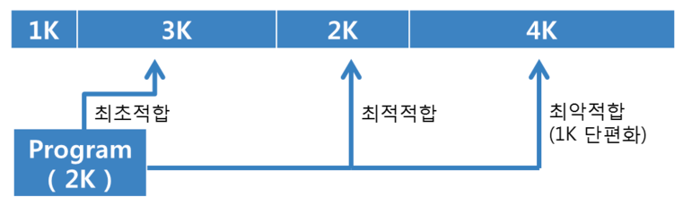

# 메모리 관리
- 프로세스들을 위해 메모리를 할당하고 제거하며 보호하는 활동이다. 
- 더 단순하게는 프로세스의 요청에 따라 메모리의 일부를 할당하고, 필요 없으면 자유로이 재사용할 수 있도록 하는 것
- 디스크에 있는 프로그램을 실행하려면 먼저 메모리에 적재한 후 메모리 관리자가 예약된 메모리를 할당해 주어야한다.

# 메모리 구조와 매핑(사상)
- 메모리를 관리하는 방법을 알아보려면 먼저 관리 대상이 되는 메모리의 구조를 이해해야 한다.
- 명령어를 실행하는 과정에서 메모리는 주소의 연속으로, 이 주소는 크게 두 가지 관점에서 해석할 수 있다.

# 스와핑
- 다중 프로그래밍 환경에서 프로세스는 사용자 프로그램이 끝날 때까지 메모리에 저장되는 원칙을 지켜왔다.
- 그러나 이 방법은 프로세스를 빈번하게 교환하는 순환 할당 알고리즘이나 우선순위에 바탕을 둔 알고리즘에는 적합하지 않다.
- 프로세스 할당이 끝나고 수행이 완료된 프로세스는 보조기억장치로 보내고(스왑아웃), 새롭게 시작하는 프로세스는 메모리에 적재해야 한다(스왑 인)
- 물론 프로세스는 메모리에 있어야 수행되므로 일시적으로 디스크로 이동ㄷ다가 메모리로 되돌아와 다시 수행할 수 있다.

# 최초 적합 방법
- 최초 적합(first-fit) 방법은 프로세스를 사용 가능 공간 중 충분히 큰 첫 번째 공간에 할당한다.
- 검색을 사용 가능 공간의 리스트 맨 앞이나 이전의 최초 적합 검색이 끝났던 곳에서 시작하면 충분히 큰 사용 공간을 빨리 찾을 수 있다.
- 하지만 이 방법은 공간 활용률이 떨어질 수 있다는 단점이 있다.

# 최적 적합 방법
- 최적 적합(best-fit) 방법은 프로세스를 충분히 큰 사용 가능 공간 중에서 들어갈 수 있는 가장 작은 공간에 할당한다.
- 사용 가능 공간이 크기 순으로 정렬되어 있지 않으면 전체를 검색해야 한다.
- 따라서 사용 가능 공간을 계속 정렬하는 과정이 필요하므로 비효율적일 수 있다.

# 최악 적합 방법
- 최악 적합(worst-fit) 방법은 프로세스를 가장 큰 사용 가능 공간에 할당한다.
- 사용 가능 공간이 크기 순으로 정렬되어 있지 않으면 전체를 검색해야 한다.
- 가장 큰 사용 가능 공간에 할당하기 때문에 가장 작은 또 다른 사용 가능 공간을 만드는 최적 적합보다 메모리 활용 면에서 더 유용하다.

